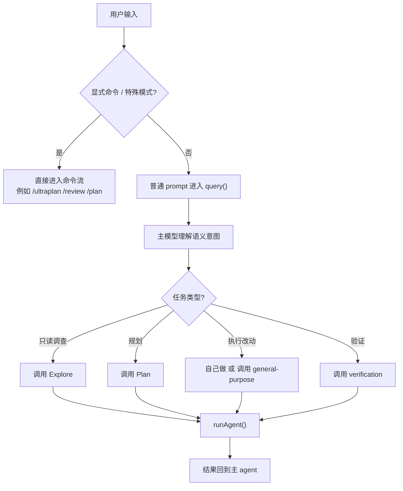

# Agent 流程示例

## 目的
这份文档用具体例子解释 Claude Code 中“用户输入 -> 意图识别 -> 主 agent -> 子 agent / tools”是怎么流动的。

阅读建议：

- 想看整体结构：先看 [AGENT_SUBSYSTEM.md](./AGENT_SUBSYSTEM.md)
- 想看意图识别位置：再看 [INTENT_RECOGNITION.md](./INTENT_RECOGNITION.md)
- 想看具体落地过程：看这份示例文档

---

## 示例 1：只读排查问题

### 用户输入
`帮我看一下登录失败的问题出在哪，先别改代码`

### 第 1 步：输入预处理
进入 `processUserInput()` 后，系统先做硬路由判断：

- 不是 slash command
- 不是 bash 模式
- 不包含 `ultraplan` 等特殊关键字

结果：

- 这条输入被当作普通 prompt
- 包装成 `UserMessage`
- 进入主 `query()`

### 第 2 步：主模型做语义理解
主 agent 结合：

- “看一下问题出在哪”
- “先别改代码”
- 当前工具集
- 当前项目上下文

会推断：

- 这是一个调查 / 分析任务
- 是只读任务
- 更适合走探索型 agent

### 第 3 步：主 agent 调用 `AgentTool`
内部大致会形成类似的委派：

- `description`: `investigate login failure`
- `prompt`: `Find why login is failing. Read-only investigation only. Do not modify code.`
- `subagent_type`: `Explore`

### 第 4 步：`AgentTool.call()` 调度
这一层不再理解用户意图，而是：

- 找到 `Explore` 的 `AgentDefinition`
- 套用只读工具限制
- 检查权限和 MCP 依赖
- 选择同步执行

### 第 5 步：进入 `runAgent()`
系统给 Explore 子代理建立独立环境：

- 独立 `agentId`
- 独立 `ToolUseContext`
- 独立消息历史
- 独立文件读取缓存
- 只读工具集

### 第 6 步：Explore agent 执行
它可能会：

1. 用 `Glob` 找登录相关文件
2. 用 `Grep` 搜 `login`、`auth`、`invalid credentials`
3. 用 `Read` 打开候选文件
4. 汇总失败原因

### 第 7 步：结果回到主 agent
子代理结果被记录进 transcript，再返回给主 agent，主 agent 再整理成面向用户的话术。

### 这个例子说明什么
这说明 Claude Code 不是“前置分类器直接选 Explore”，而是：

**主模型先理解“这是只读调查任务”，然后主动调用 Explore。**

---

## 示例 2：执行型改动任务

### 用户输入
`修一下登录失败的问题，并跑一下相关测试`

### 第 1 步：输入预处理
和示例 1 类似：

- 不是 slash command
- 不是 bash 模式
- 不是特殊关键字路由

所以仍然进入普通 `query()`

### 第 2 步：主模型做语义理解
这次主模型会推断：

- 不是只读调查
- 用户要真正修问题
- 还要求跑测试

这类任务可能有两种路径：

#### 路径 A：主 agent 自己直接做
如果任务不复杂，主 agent 可能直接：

- 搜代码
- 改文件
- 跑测试

#### 路径 B：主 agent 委派给 `general-purpose`
如果任务较复杂，主 agent 可能调用：

- `subagent_type: general-purpose`

让子代理完成：

- 查问题
- 改代码
- 跑局部验证

### 第 3 步：执行型 agent 特征
`general-purpose` 和 `Explore` 的区别在于：

- 它不是只读
- 可以使用完整工具集
- 可以修改文件
- 可以执行多步骤任务

### 第 4 步：可能的后续
如果主 agent 觉得修改较大，完成后还可能再委派一次：

- `verification`

用于独立验证。

### 这个例子说明什么
同样是“登录失败”，但只要用户目标变成“修复”，主模型选路就会变化。

这说明 Claude Code 的 agent 选择是：

**按任务目标语义路由，不是按关键词硬匹配。**

---

## 示例 3：收尾验证任务

### 用户输入
`改完之后帮我验证一下，重点看接口边界情况`

### 第 1 步：输入预处理
仍然是普通 prompt，进入 `query()`

### 第 2 步：主模型做语义理解
主 agent 会识别出：

- 这是验证任务
- 重点不是开发，而是找问题
- 用户明确要求边界情况验证

### 第 3 步：主 agent 调用 `verification`
内部会倾向于委派：

- `subagent_type: verification`

并传入：

- 原始任务描述
- 修改过的文件
- 期望验证重点

### 第 4 步：verification agent 的运行方式
这个 agent 的特点是：

- 默认偏后台
- 不允许改项目文件
- 必须实际跑命令
- 结果必须以 `VERDICT: PASS/FAIL/PARTIAL` 收尾

### 第 5 步：输出形式
它返回的不是普通“看起来没问题”，而是结构化验证报告：

- Check
- Command run
- Output observed
- Result
- 最后 verdict

### 这个例子说明什么
Claude Code 的验证 agent 不是“辅助解释”，而是**工程化收尾角色**。

如果你要模仿 Claude，这类 agent 非常值得单独抽出来。

---

## 示例 4：规划优先任务

### 用户输入
`先帮我规划一下怎么把现在的认证系统改成多租户，先不要动代码`

### 第 1 步：输入预处理
不是 slash command，所以进入普通 prompt 路径。

### 第 2 步：主模型理解语义
主模型会读出几个关键信号：

- “先帮我规划一下”
- “改成多租户”
- “先不要动代码”

这基本就是：

- 架构规划任务
- 只读
- 不执行改动

### 第 3 步：主 agent 可能委派 `Plan`
于是内部会更倾向于：

- `subagent_type: Plan`

### 第 4 步：Plan agent 的行为
它会：

1. 搜相关模块
2. 找现有认证链路
3. 找相似实现模式
4. 输出实施步骤
5. 列出关键文件

### 第 5 步：返回给主 agent
主 agent 再把这个规划结果组织成面向用户的说明。

### 这个例子说明什么
Claude Code 里“规划型 agent”不是一个 UI 功能，而是主模型在合适语义下主动选出来的只读专家 agent。

---

## 示例 5：命令硬路由

### 用户输入
`/ultraplan 把权限系统重构方案详细规划一下`

### 第 1 步：输入预处理直接分流
这里不会先进普通 prompt 再让主模型判断，而是：

- slash command 先被识别
- 直接进入 `processSlashCommand()`

这属于**显式意图**。

### 第 2 步：进入命令系统
后续逻辑由对应命令实现主导，而不是由主模型自由选择 agent。

### 这个例子说明什么
Claude Code 对两类意图是区别处理的：

#### 显式意图
用户明确说了 `/plan`、`/review`、`/ultraplan`

-> 规则优先，直接进命令系统

#### 隐式意图
用户只是自然语言描述想做什么

-> 先进入主模型，再由主模型决定是否派 agent

---

## 一张总图：把几个例子统一起来

## 对你最有价值的结论

### 1. 不要一开始就做重型 intent classifier
Claude Code 看起来更像：

- 规则路由一小部分
- 大部分语义判断交给主 agent

### 2. 先把“显式意图”和“隐式意图”分开
你自己的系统里建议也这样做：

- `/plan`、`/review`、`/search` 这种走显式命令
- 普通自然语言走主 agent

### 3. 把 agent 角色设计成语义后果，而不是关键词映射
不是：

- 出现“bug” -> verification

而是：

- 用户想调查 -> Explore
- 用户想规划 -> Plan
- 用户想执行 -> general-purpose
- 用户想独立验证 -> verification

### 4. 真正值得模仿的是这一条
**输入先做轻规则分流，主模型再做语义决策，最后由 `AgentTool` 做工程调度。**
