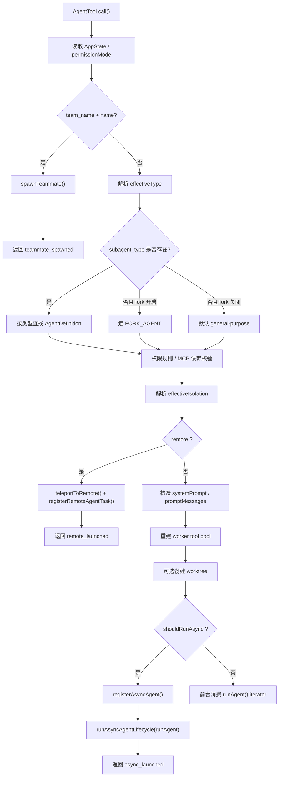
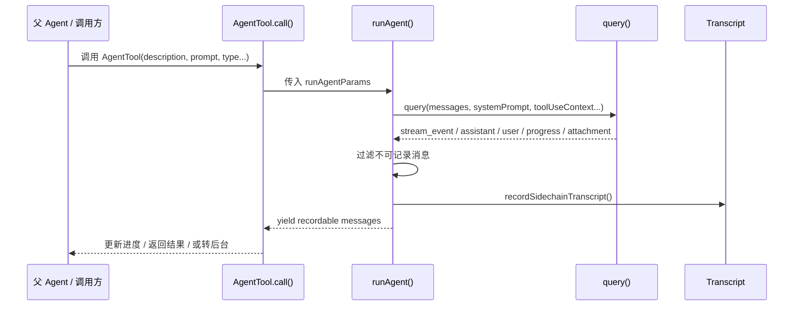
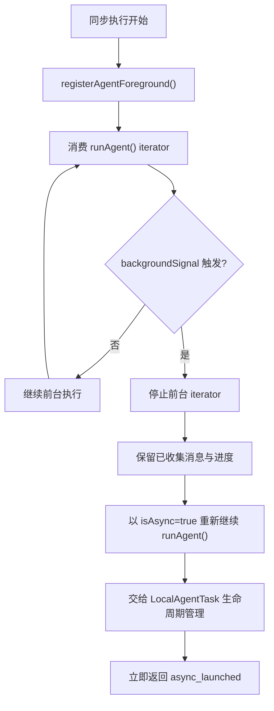

# Agent 子系统分析

## 总览
这个项目里的 Agent 不是简单的“再开一个模型请求”，而是一个完整的子代理系统。它由 4 个核心部分组成：

- `AgentDefinition`：定义 agent 的角色和运行策略
- `AgentTool`：对外暴露“启动子代理”的统一入口
- `runAgent`：真正执行子代理会话
- `Task` 系统：承载 agent 的生命周期、进度、后台化和通知

一句话概括：

**以 `AgentDefinition` 为配置单元，以 `AgentTool` 为调度入口，以 `runAgent` 为执行核心，以任务系统承载生命周期。**

相关补充文档：

- [意图识别与流程嵌入](./INTENT_RECOGNITION.md)
- [Agent 流程示例](./AGENT_FLOW_EXAMPLES.md)
- [主 System Prompt 结构](./SYSTEM_PROMPT_STRUCTURE.md)

## 图 1：Agent 子系统总结构
```text
用户 / 父 Agent
    |
    v
+--------------------+
| AgentTool.call()   |
| 调度与策略决策     |
+--------------------+
    |
    +--> 选择 AgentDefinition
    |    - prompt
    |    - tools
    |    - model
    |    - permission
    |    - isolation
    |
    +--> 选择执行路径
         - sync
         - async
         - teammate
         - remote
              |
              v
      +--------------------+
      | runAgent()         |
      | 搭建子会话环境     |
      +--------------------+
              |
              v
      +--------------------+
      | query()            |
      | 模型 + tool loop   |
      +--------------------+
              |
              v
      +--------------------+
      | 消息 / transcript  |
      | progress / result  |
      +--------------------+
              |
              v
      +--------------------+
      | Task 系统          |
      | Local/Remote Agent |
      +--------------------+
```

## 一、AgentDefinition 是什么
入口文件：[tools/AgentTool/loadAgentsDir.ts](./tools/AgentTool/loadAgentsDir.ts)

这里的 agent 不是单纯的 prompt，而是一套完整的运行配置。一个 `AgentDefinition` 可以描述：

- `agentType`：agent 类型名
- `whenToUse`：适用场景
- `tools` / `disallowedTools`：允许和禁止的工具
- `model`：模型选择
- `effort`：思考强度
- `permissionMode`：权限模式
- `mcpServers`：附加 MCP 服务器
- `skills`：预加载技能
- `maxTurns`：最大轮数
- `memory`：记忆范围
- `background`：是否默认后台运行
- `isolation`：隔离方式，例如 `worktree`
- `omitClaudeMd`：是否省略 CLAUDE.md 上下文

这意味着 agent 在架构上更像“运行策略对象”，不是“提示词模板”。

## 二、AgentTool 的输入输出契约
入口文件：[tools/AgentTool/AgentTool.tsx](./tools/AgentTool/AgentTool.tsx)

### 输入字段
`AgentTool` 的主要输入有：

- `description`：任务简述，通常 3 到 5 个词
- `prompt`：交给子代理的具体任务
- `subagent_type`：要使用的 agent 类型
- `model`：可选模型覆盖，支持 `sonnet`、`opus`、`haiku`
- `run_in_background`：是否后台运行
- `name`：给 spawned agent 命名，便于后续 `SendMessage`
- `team_name`：团队名
- `mode`：权限模式
- `isolation`：隔离方式，通常是 `worktree`，内部版本还支持 `remote`
- `cwd`：覆盖子代理工作目录

### 输出状态
公开输出 schema 主要有两类：

- `status: completed`
  表示同步执行完成，直接返回结果
- `status: async_launched`
  表示已后台启动，返回 `agentId`、`description`、`prompt`、`outputFile`

内部还存在两类额外状态：

- `status: teammate_spawned`
- `status: remote_launched`

所以 `AgentTool` 首先返回的不是“业务答案”，而是“这个 agent 被如何调度和执行”。

## 三、内建 Agent 一览
内建 agent 注册入口：[tools/AgentTool/builtInAgents.ts](./tools/AgentTool/builtInAgents.ts)

当前能看到的典型内建角色包括：

- `GENERAL_PURPOSE_AGENT`
- `STATUSLINE_SETUP_AGENT`
- `EXPLORE_AGENT`
- `PLAN_AGENT`
- `CLAUDE_CODE_GUIDE_AGENT`
- `VERIFICATION_AGENT`

其中：

- `EXPLORE_AGENT` 和 `PLAN_AGENT` 受实验开关控制
- `VERIFICATION_AGENT` 也受 feature flag 和实验开关控制
- `COORDINATOR_MODE` 下会切换到另一套 coordinator workers

## 四、各内建 Agent 角色分析

### 1. GENERAL_PURPOSE_AGENT
文件：[tools/AgentTool/built-in/generalPurposeAgent.ts](./tools/AgentTool/built-in/generalPurposeAgent.ts)

定位：

- 通用研究和多步骤执行 agent
- 适合查代码、跨文件分析、复杂问题调查

Prompt 要点：

- 强调自己是 Claude Code 的通用执行 agent
- 任务要做完整，但不要过度设计
- 擅长大代码库搜索、跨文件分析、多步骤研究
- 完成后给简洁报告，供父 agent 转述

工具：

- `tools: ['*']`

输入输出特点：

- 最像默认 worker
- 输入完全由父 agent 的 `prompt` 决定
- 输出为简洁结果摘要

### 2. EXPLORE_AGENT
文件：[tools/AgentTool/built-in/exploreAgent.ts](./tools/AgentTool/built-in/exploreAgent.ts)

定位：

- 只读搜索 agent
- 用于快速找文件、找实现、查模式、回答代码结构问题

Prompt 要点：

- 明确声明这是 read-only exploration
- 严禁创建、修改、删除、移动文件
- 只允许搜索、读取、分析现有代码
- 强调速度和并行搜索

工具限制：

- 禁用 `AgentTool`
- 禁用 `ExitPlanMode`
- 禁用 `FileEdit`
- 禁用 `FileWrite`
- 禁用 `NotebookEdit`

模型：

- 外部环境默认 `haiku`
- 内部环境可能继承父模型

额外特征：

- `omitClaudeMd: true`

输出特点：

- 普通文本报告
- 重点是快速、清楚地汇报发现

### 3. PLAN_AGENT
文件：[tools/AgentTool/built-in/planAgent.ts](./tools/AgentTool/built-in/planAgent.ts)

定位：

- 软件架构和实施规划 agent
- 用于产出实现方案、步骤、关键文件和依赖顺序

Prompt 要点：

- 明确是 read-only planning
- 先理解需求，再广泛探索，再形成方案
- 输出实现步骤、依赖关系、潜在风险
- 结尾必须列出 `Critical Files for Implementation`

工具限制：

- 和 `Explore` 类似，是只读 agent
- 同样禁用编辑类工具和再派生 agent

模型：

- `inherit`

额外特征：

- `omitClaudeMd: true`

输出特点：

- 比 `Explore` 更结构化
- 结尾必须列出 3 到 5 个关键文件

### 4. VERIFICATION_AGENT
文件：[tools/AgentTool/built-in/verificationAgent.ts](./tools/AgentTool/built-in/verificationAgent.ts)

定位：

- 验证 agent
- 职责不是“觉得没问题”，而是主动尝试把实现搞坏

Prompt 要点：

- 明确要求独立验证，不接受“看代码觉得对”
- 禁止修改项目目录
- 要跑 build、test、lint、接口调用、边界值、并发/idempotency 等验证
- 每个检查必须带命令和实际输出
- 结尾必须输出 `VERDICT: PASS/FAIL/PARTIAL`

工具限制：

- 禁用 `AgentTool`
- 禁用 `ExitPlanMode`
- 禁用写文件/编辑类工具
- 允许用 shell 验证
- 允许在临时目录写临时测试脚本

模型：

- `inherit`

额外特征：

- `background: true`
- `color: 'red'`
- 有 `criticalSystemReminder_EXPERIMENTAL`

输出特点：

- 这是格式要求最严格的内建 agent
- 每个检查项都要写：
  - Check
  - Command run
  - Output observed
  - Result
- 最后必须给 verdict

### 5. STATUSLINE_SETUP_AGENT
文件：[tools/AgentTool/built-in/statuslineSetup.ts](./tools/AgentTool/built-in/statuslineSetup.ts)

定位：

- 专门帮用户配置 Claude Code status line

Prompt 要点：

- 指导它从 shell 配置里读取 `PS1`
- 指导它把 `PS1` 转成 status line command
- 指导它更新 `~/.claude/settings.json`
- 提供 status line 命令可接收的 JSON stdin 结构

工具：

- `Read`
- `Edit`

模型：

- `sonnet`

输出特点：

- 输出应总结配置结果
- 并提醒父 agent：后续状态栏相关修改继续使用这个 agent

这是一个典型的窄领域专用 agent。

### 6. CLAUDE_CODE_GUIDE_AGENT
文件：[tools/AgentTool/built-in/claudeCodeGuideAgent.ts](./tools/AgentTool/built-in/claudeCodeGuideAgent.ts)

定位：

- Claude Code / Claude Agent SDK / Claude API 文档导览 agent

Prompt 要点：

- 按问题类型判断属于 Claude Code、Agent SDK 还是 Claude API
- 优先抓官方 docs map 和文档页面
- 不够时再用 web search
- 回答要基于官方文档，给出可执行建议和链接
- 会把当前项目的 custom skills、custom agents、MCP、plugin commands、settings 注入上下文

工具：

- 本地读文件工具
- `WebFetch`
- `WebSearch`
- 有些环境下会用 `Glob/Grep`，有些环境下转成 `Bash`

模型：

- `haiku`

权限：

- `permissionMode: dontAsk`

输出特点：

- 更像产品说明 / 文档咨询 agent
- 目标不是改代码，而是解释如何使用 Claude 系列产品

## 五、内建 Agent 的分类
从设计上，这些内建 agent 大致可以分成三类：

### 通用执行型
- `general-purpose`

### 只读分析型
- `Explore`
- `Plan`

### 专项工作型
- `verification`
- `statusline-setup`
- `claude-code-guide`

这说明它不是“一个子代理 + 换 prompt”，而是**有角色边界的 agent 编排体系**。

## 六、AgentTool.call() 主调用链
下面开始看主调用链，入口在 [tools/AgentTool/AgentTool.tsx](./tools/AgentTool/AgentTool.tsx)。

## 图 2：AgentTool.call() 决策流程


### 第一步：读取上下文和权限
`call()` 开头会先拿到：

- 当前 `AppState`
- 当前 `permissionMode`
- 根级 `setAppState` 通道

这里的关键点是：如果当前调用发生在 in-process teammate 里，普通 `setAppState` 可能是 no-op，所以它会优先使用 `setAppStateForTasks`，确保任务注册、进度和 kill 等信息仍能写回根 store。

### 第二步：处理 teammate / team spawn
如果同时存在：

- `team_name`
- `name`

那么不会进入普通 subagent 路径，而是直接走 `spawnTeammate()`。

这条路径的输出状态是：

- `teammate_spawned`

说明在这个系统里，“带名字 + 团队上下文”的 agent，更接近 swarm teammate，而不是普通 worker subagent。

### 第三步：决定 agent 类型
接着进入普通 agent 选择逻辑：

- 如果显式传了 `subagent_type`，优先使用它
- 如果没传 `subagent_type`，且 fork experiment 开启，则走 fork 路径
- 如果没传且 fork 没开，则默认落到 `general-purpose`

这里同时做了：

- denied agent 过滤
- allowedAgentTypes 限制
- required MCP servers 检查

所以 agent 选择不是简单地按名字查找，而是要过一层权限和依赖校验。

### 第四步：决定隔离方式
`effectiveIsolation = isolation ?? selectedAgent.isolation`

也就是说：

- 调用参数优先
- agent 自身定义次之

当前主要有两种：

- `worktree`
- `remote`（内部路径）

如果是 `remote`，会直接转入远程 session 流程，注册 `RemoteAgentTask`，返回：

- `remote_launched`

### 第五步：构造 promptMessages 与 systemPrompt
这里有两条分支：

#### 普通 agent 路径
- 根据 `selectedAgent.getSystemPrompt()` 生成 agent prompt
- 再通过 `enhanceSystemPromptWithEnvDetails()` 注入环境信息
- 用户任务被包装成一个普通 `createUserMessage({ content: prompt })`

#### fork 路径
- 不使用 fork agent 自己的 prompt 重建 system prompt
- 直接继承父代理已经渲染好的 system prompt
- 通过 `buildForkedMessages()` 把父 assistant 消息、placeholder tool_result 和 fork directive 拼出来

这个分支非常关键，目的是保证 fork child 拿到和父级尽量一致的上下文前缀，提升 prompt cache 命中率。

### 第六步：决定同步还是异步
`shouldRunAsync` 由多个条件共同决定：

- `run_in_background === true`
- `selectedAgent.background === true`
- coordinator mode
- fork mode
- kairos / proactive mode

如果满足这些条件，就会走后台 agent 路径，否则走同步执行路径。

### 第七步：构造 worker tool pool
`AgentTool` 不会简单继承父代理当前工具限制，而是重新按 worker 自己的权限模式组装工具池：

- `workerPermissionContext`
- `assembleToolPool(workerPermissionContext, appState.mcp.tools)`

这意味着子代理的工具面是**按自己定义重新计算**的，而不是直接复制父代理当前工具可见性。

### 第八步：处理 worktree 隔离
如果 `effectiveIsolation === 'worktree'`：

- 提前创建 worktree
- 后续把执行 cwd 切到 worktree
- 结束时根据是否有改动决定清理还是保留

这一步说明 worktree 不是一个抽象标记，而是真正的 Git 工作副本隔离。

### 第九步：组装 runAgent 参数
最终 `AgentTool.call()` 会把所有调度结果拼成 `runAgentParams`，包括：

- `agentDefinition`
- `promptMessages`
- `toolUseContext`
- `canUseTool`
- `isAsync`
- `querySource`
- `override.systemPrompt`
- `availableTools`
- `forkContextMessages`
- `worktreePath`
- `description`

也就是说，`AgentTool.call()` 的工作本质上就是：

**选 agent -> 定权限 -> 定工具 -> 定上下文 -> 定隔离 -> 定同步/异步 -> 再把执行交给 `runAgent()`**

## 七、runAgent() 的职责
入口文件：[tools/AgentTool/runAgent.ts](./tools/AgentTool/runAgent.ts)

## 图 3：runAgent() 内部结构
```text
runAgent()
  |
  +-- 生成 agentId / transcriptSubdir
  +-- 准备 initialMessages
  |    - forkContextMessages
  |    - promptMessages
  |    - skill preload messages
  |    - hook additional context
  |
  +-- 构造上下文
  |    - userContext
  |    - systemContext
  |    - permission projection
  |    - resolvedTools
  |    - agent MCP tools
  |
  +-- createSubagentContext()
  |    - 独立 ToolUseContext
  |    - 独立 abortController
  |    - 独立 messages
  |    - 独立 file cache
  |
  +-- 调 query()
  |    - systemPrompt
  |    - contexts
  |    - canUseTool
  |    - maxTurns
  |
  +-- 处理 query 输出
  |    - 过滤 stream_event
  |    - 记录 transcript
  |    - yield message
  |
  +-- finally cleanup
       - MCP cleanup
       - hook cleanup
       - file cache clear
       - todos clear
       - shell task kill
```

从当前代码可以确认，`runAgent()` 负责：

- 生成独立 `agentId`
- 建立 agent transcript 子目录
- 准备 `initialMessages`
- 克隆或创建文件缓存
- 读取 user/system context
- 应用 `omitClaudeMd` / `omitGitStatus` 等上下文裁剪
- 重写 agent 的权限模式
- 解析最终可用工具集
- 生成最终 agent system prompt
- 创建独立 abortController
- 执行 hooks

也就是说，`runAgent()` 不是单纯“发一次 query”，而是在真正进入模型调用前，先把子代理自己的运行环境完整搭起来。

## 八、当前阶段结论
到这里可以先下一个阶段性结论：

### `AgentTool.call()` 做的是调度
它关心：

- 选哪个 agent
- 什么权限
- 什么工具
- 是否后台
- 是否隔离
- 是否 remote

### `runAgent()` 做的是执行
它关心：

- 子代理上下文
- prompt
- 工具集
- 权限态
- 缓存
- transcript
- 实际 query 循环

所以这两层的边界非常清楚：

**`AgentTool.call()` 是 orchestration / scheduling，`runAgent()` 是 execution runtime。**

## 九、下一步建议
接下来最值得继续看的，是：

1. `runAgent()` 最终如何调用 `query()` 并产出消息流
2. 同步 agent 如何被中途 background 化
3. `LocalAgentTask` / `RemoteAgentTask` 如何承接生命周期
4. `SendMessage` 和 mailbox 如何把多个 agent 串起来

当前最自然的下一步是：

**继续看 `runAgent()` 内部是怎么进入 `query()`，以及消息、权限、工具调用是怎么流动的。**

## 十、runAgent() 如何真正执行子代理
继续看 [tools/AgentTool/runAgent.ts](./tools/AgentTool/runAgent.ts) 可以发现，`runAgent()` 的职责比“跑一次 query”要重得多。

### 1. 执行前的环境搭建
在进入 `query()` 之前，它会先完成这些准备动作：

- 生成独立 `agentId`
- 设置 transcript 子目录
- 为 Perfetto tracing 注册 agent
- 处理 fork 场景下的上下文继承
- 准备 `initialMessages`
- 克隆或创建独立 `readFileState`
- 读取 `userContext` 和 `systemContext`
- 根据 agent 类型裁剪上下文，例如省略 `claudeMd` 或 `gitStatus`

这说明每个子代理运行前，都会先有一个“会话沙箱初始化”过程。

### 2. 权限模式重写
`runAgent()` 会重新包装 `getAppState()`，在里面动态覆盖：

- `toolPermissionContext.mode`
- `shouldAvoidPermissionPrompts`
- `awaitAutomatedChecksBeforeDialog`

并且支持 `allowedTools` 覆盖 session allow rules。

这意味着子代理的权限不是直接继承父代理当前状态，而是**在执行期重新投影成自己的权限视图**。

### 3. 工具集重算
`runAgent()` 会根据以下条件确定最终工具集：

- `useExactTools`
- `availableTools`
- `resolveAgentTools(agentDefinition, availableTools, isAsync)`
- agent 自己附加的 MCP tools

最后会把 agent 专属 MCP tools 和解析后的工具集做 merge。

所以子代理看到的 `tools`，是一个重新求值后的结果，不是父级工具列表的简单拷贝。

### 4. 技能、Hook、MCP 都可以挂到 Agent 上
在真正执行前，它还会做三件很关键的事：

#### 注册 frontmatter hooks
如果 agent 定义里有 `hooks`，会注册到当前 agent 生命周期中。

#### 预加载 skills
如果 agent frontmatter 里声明了 `skills`，会：

- 解析 skill 名
- 读取 skill prompt
- 把 skill 内容转成 meta user message
- 提前塞进 `initialMessages`

#### 初始化 agent-specific MCP servers
如果 agent 自己定义了 `mcpServers`，会：

- 在父 MCP 基础上附加连接
- 拉取对应工具
- 在 agent 结束时执行 cleanup

这三点说明：**agent 是可以带“局部运行时插件”的**。

### 5. createSubagentContext：真正生成子代理上下文
这里会调用 [utils/forkedAgent.ts](./utils/forkedAgent.ts) 里的 `createSubagentContext()`。

这个 helper 的关键作用是：

- 给子代理创建独立的 `ToolUseContext`
- 默认隔离大部分可变状态
- 可选择共享某些 callback，例如 `setAppState`、`setResponseLength`
- 为 agent 注入：
  - 新的 `options`
  - 新的 `messages`
  - 新的 `abortController`
  - 新的 `agentId`
  - 新的 `agentType`

所以从架构上说，**子代理不是借用父代理上下文，而是用父上下文作为模板，派生出一个新的 ToolUseContext**。

### 6. runAgent() 进入 query()
核心调用是：

- `query({ messages, systemPrompt, userContext, systemContext, canUseTool, toolUseContext, querySource, maxTurns })`

这意味着子代理真正进入模型循环时，已经具备：

- 独立 message history
- 独立 system prompt
- 独立 user/system context
- 独立 toolUseContext
- 独立 maxTurns

从这一刻开始，它本质上就是一个独立的小型 Claude Code 会话。

## 十一、消息是怎么回流的
`runAgent()` 对 `query()` 的输出做了几层筛选和转发。

## 图 4：子代理消息回流路径


### 1. 只记录可记录消息
它只把下面这些类型当作“recordable message”：

- `assistant`
- `user`
- `progress`
- `system.compact_boundary`

这些消息会被写入：

- sidechain transcript

并通过 `yield` 向上层返回。

### 2. attachment 单独处理
例如 `max_turns_reached` 这种 attachment：

- 不进入普通 transcript 流
- 但会被向上层传递

说明子代理内部的“消息流”和“控制信号”是分开的。

### 3. query 流里的 stream_event 不直接上抛
例如：

- `message_start`

这类事件会被 `runAgent()` 用来更新父级 API metrics（如 TTFT），但不会作为普通用户可见消息直接产出。

所以 `runAgent()` 同时扮演了：

- 消息过滤器
- 指标桥接器
- transcript 记录器

## 十二、同步 Agent 为什么能中途变成后台 Agent
这一段逻辑主要在 [tools/AgentTool/AgentTool.tsx](./tools/AgentTool/AgentTool.tsx) 里，而不是 `runAgent()` 里。

## 图 5：同步 Agent 转后台流程


同步执行路径会先：

- `registerAgentForeground()`
- 建立 foreground task
- 开始消费 `runAgent()` 的 iterator

但在循环中，它会同时 race 两件事：

- `agentIterator.next()`
- `backgroundSignal`

如果用户或系统把它 background 化，就会发生：

1. 前台 iterator 停止
2. 当前已收集消息保留
3. 重新以 async 模式继续运行 `runAgent()`
4. 背景任务改由 `LocalAgentTask` 生命周期接管
5. 立即返回 `status: async_launched`

这说明“同步转后台”不是单纯改个 flag，而是一次**执行模式切换**：

- 前半程在前台消费
- 后半程交给后台 task runner 继续

## 十三、LocalAgentTask 承载了什么
在 [tasks/LocalAgentTask/LocalAgentTask.tsx](./tasks/LocalAgentTask/LocalAgentTask.tsx) 里可以看到，本地 agent task 负责：

- 注册运行中的 background agent
- 存储 `prompt`、`selectedAgent`、`progress`
- 维护 token 和 tool use 统计
- 保存 recent activities / summary
- 处理 kill / fail / complete
- 发出 task notification
- 管理输出文件

所以 `LocalAgentTask` 本质上是：

**Agent 的后台执行容器 + 可观测状态载体**

## 十四、resumeAgentBackground 说明了什么
在 [tools/AgentTool/resumeAgent.ts](./tools/AgentTool/resumeAgent.ts) 可以看到，后台 agent 不是一次性进程，而是支持恢复的。

恢复逻辑会：

- 读取 transcript
- 读取 metadata
- 重建 replacement state
- 恢复 worktree 路径
- 找回原始 `agentType`
- 重新构造 `runAgentParams`
- 再次调用 `runAgent()`

这表明 sidechain transcript 和 metadata 不是附属日志，而是**恢复协议的一部分**。

## 图 6：恢复后台 Agent 的数据依赖
```text
resumeAgentBackground()
  |
  +-- 读取 transcript
  |    - 历史 messages
  |    - content replacements
  |
  +-- 读取 metadata
  |    - agentType
  |    - worktreePath
  |    - description
  |
  +-- 重建 replacement state
  +-- 重建 runAgentParams
  +-- registerAsyncAgent()
  +-- 再次进入 runAgent()
```

## 十五、这一阶段的结构性结论
到这里可以把 Agent 执行路径总结成下面这条链：

1. `AgentTool.call()` 负责调度和策略决策
2. `runAgent()` 负责搭建子代理运行环境
3. `query()` 负责真正跑模型循环
4. `runAgent()` 负责把 query 输出过滤、记录、回传
5. `LocalAgentTask` / `RemoteAgentTask` 负责承载后台生命周期
6. `resumeAgentBackground()` 负责把持久化 transcript 重新变回可运行 agent

换句话说，这套 agent 机制不是“spawn 一个模型请求”，而是：

**spawn 一个可恢复、可观测、可任务化、可继续通信的子会话。**

## 十六、下一步
接下来最值得继续看的是两条线：

1. `query()` 内部 tool call 是怎么和子代理上下文交互的
2. `SendMessage` / teammate mailbox 是怎么把多个 agent 串联成协作网络的

如果继续沿主干深入，下一步最自然的是：

**看 `SendMessageTool` 和 teammate / mailbox 模型，理解 agent 之间如何通信。**

## 图 7：多 Agent 协作通信模型
```text
主 Agent
  |
  +-- AgentTool -> 普通 subagent
  |      |
  |      +-- 完成后通过结果回流给主 Agent
  |
  +-- AgentTool(name + team_name) -> teammate
         |
         +-- SendMessageTool
         |      |
         |      +-- writeToMailbox()
         |      +-- 点对点消息
         |      +-- 广播消息
         |      +-- 结构化消息(approval/shutdown)
         |
         +-- teammate mailbox
                |
                +-- 多 agent 协作网络
```

## 十七、如果要模仿 Claude Agent，这些是必要设计点
如果目标不是“复刻 prompt”，而是模仿它的工程设计模式，那么下面这些点是必须掌握的。

### 1. Agent 不是 prompt，而是运行配置对象
要学习 `AgentDefinition` 这种建模方式。一个 agent 至少应该包含：

- 角色说明
- 工具白名单 / 黑名单
- 模型
- 权限模式
- 最大轮数
- 是否后台
- 是否隔离
- 是否挂 MCP / skills / hooks

也就是说，agent 应该是“可调度执行单元”，而不是单纯的一段提示词。

### 2. 调度层和执行层必须分离
这个仓库里分得很清楚：

- `AgentTool.call()`：负责选 agent、定权限、定工具、定执行方式
- `runAgent()`：负责真正把子代理跑起来

这是一个非常关键的模式。不要把“选谁执行”和“怎么执行”混成一个函数。

### 3. 子代理必须有独立上下文
不能把父 agent 的状态直接拿给子 agent 共用，而是要派生新的运行上下文，例如：

- 新的 `ToolUseContext`
- 新的消息历史
- 新的文件缓存
- 新的 `abortController`
- 新的权限视图

多 agent 系统一旦没有这层隔离，状态很快就会互相污染。

### 4. Agent 要任务化，而不是函数化
Claude 这套设计最值得模仿的地方之一，就是把 agent 当成 task，而不是一次性函数调用。

理想状态下，agent 至少应该支持：

- 前台 / 后台切换
- 进度跟踪
- 中断
- 恢复
- 通知
- transcript 持久化

如果要仿，建议一开始就设计：

- `TaskState`
- `TaskRunner`
- `TaskStorage`

而不是只写 `runSubAgent(prompt)`。

### 5. 真正重要的不是 prompt，而是能力边界
从内建 agent 可以看出，最有价值的不是 prompt 文案本身，而是：

- 哪些工具能用
- 哪些工具不能用
- 只读还是可写
- 输出是否有强格式要求
- 是否允许继续派生子 agent

一个稳定 agent 系统依赖的是：

- 明确的能力边界
- 明确的输出协议

而不是“写得像人”的提示词。

### 6. 多 Agent 协作要靠显式消息协议
Claude 这里不是让多个 agent 直接共享一大块状态，而是走：

- `SendMessageTool`
- mailbox
- 点对点消息
- 广播
- approval / shutdown 等结构化消息

所以如果你要模仿，agent 间协作应尽量基于：

- 显式消息
- 可记录消息
- 结构化消息类型

而不是隐式共享状态。

### 7. 先做角色分工，再做模型分工
Claude 的内建 agent 不是按模型分，而是按职责分：

- 通用执行型
- 只读探索型
- 规划型
- 验证型
- 文档导览型
- 专项配置型

你在自己的系统里，也应该先定义角色边界，例如：

- Researcher
- Planner
- Executor
- Verifier
- Coordinator

然后再决定每个角色适合什么模型。

### 8. 必须有 transcript 和 resume 机制
这是从“能跑”走向“工程化”的关键能力。

Claude 这里明显很重视：

- sidechain transcript
- metadata
- background resume
- output file
- task notification

如果没有这层，你的 agent 系统大概率只能“一次性运行”，很难形成真正可持续的工作流。

## 十八、模仿 Claude Agent 的最小落地顺序
如果要自己实现一套类似的 agent 架构，建议按下面的顺序做：

1. 先定义 `AgentDefinition`
2. 再实现类似 `AgentTool` 的统一调度入口
3. 再实现独立的 `runAgent()`
4. 再把 agent 包装成 `Task`
5. 最后再加 `SendMessage` 和 mailbox 协作

一句话总结：

**你现在最该学习的不是某个内建 agent 的 prompt，而是“可配置 agent + 调度/执行分层 + 任务化生命周期 + 显式消息协作”这四件事。**
