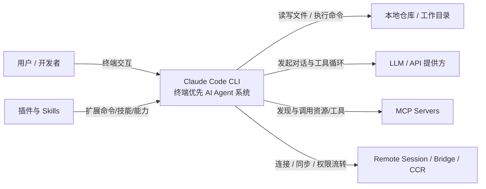
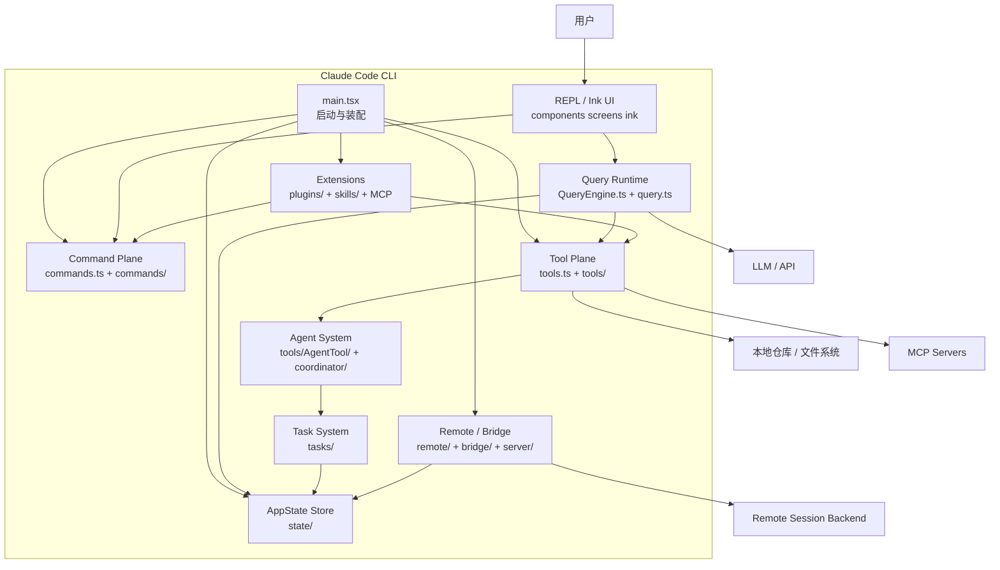
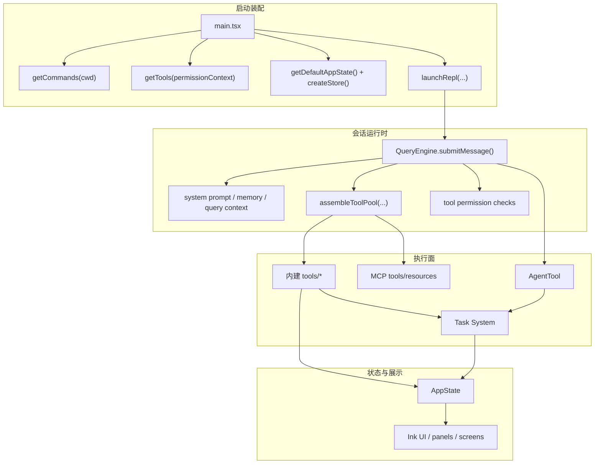
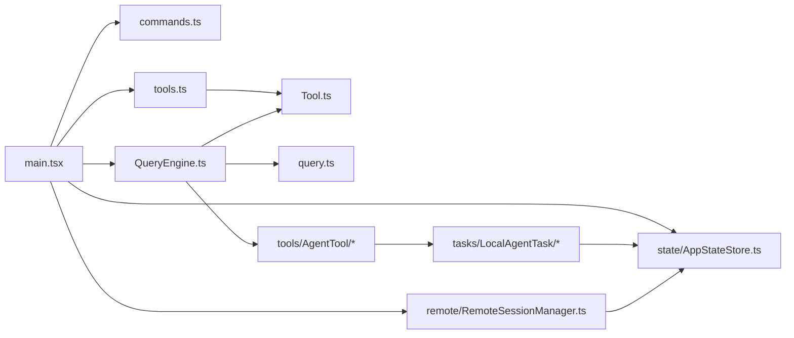
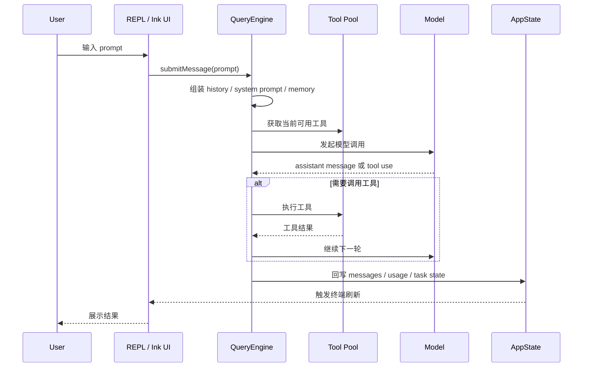
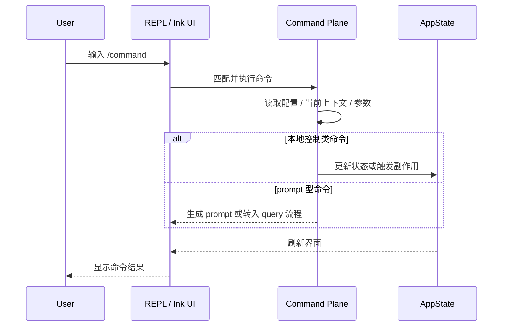
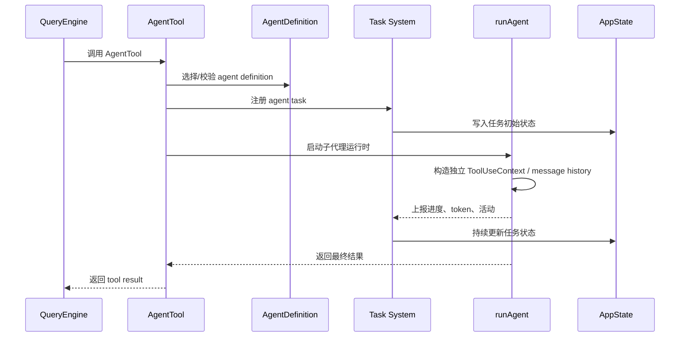
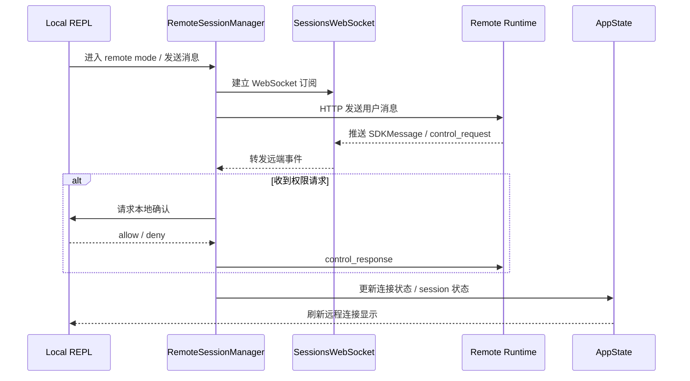
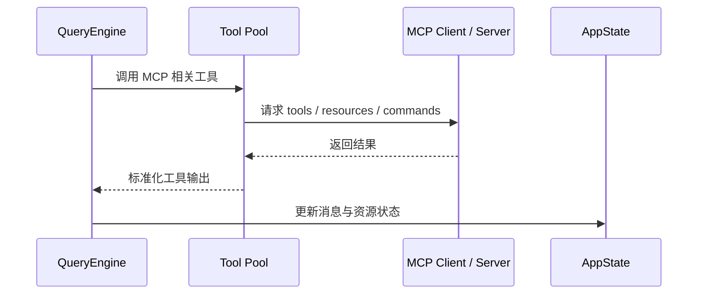
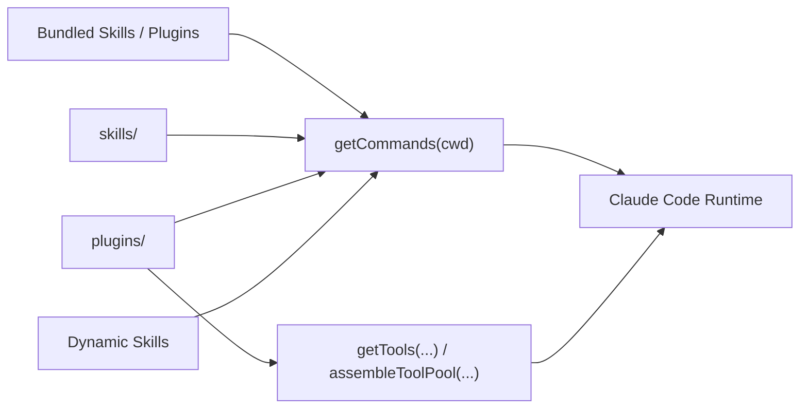

# 架构概览

## 总览
这个仓库不是传统的“Web 前端 + 后端 + 数据库”三层应用，而是一个**终端优先的 AI Agent 系统**。它的主结构可以概括为：

`CLI 入口 -> 命令/工具装配 -> 对话运行时 -> 终端 UI/状态 -> 任务系统 -> 远程与多代理扩展`

整个项目围绕本地 REPL 循环展开：

- `commands` 负责用户显式触发的控制动作
- `tools` 负责模型在对话过程中调用的执行能力
- `QueryEngine` 负责把一次对话真正跑起来

从代码实现看，这条主链路并不是松散拼接的，而是由几个明确的装配点串起来：

- `main.tsx` 在启动阶段调用 `getTools(...)`、`getCommands(...)`、`createStore(...)`、`launchRepl(...)`
- `commands.ts` 用 `getCommands(cwd)` 汇总内建命令、skills、plugin commands、plugin skills 和动态 skills
- `tools.ts` 用 `getTools(permissionContext)` 和 `assembleToolPool(...)` 组装内建工具与 MCP 工具
- `QueryEngine.ts` 用 `submitMessage()` 持续推进单轮或多轮对话执行

## 核心分层

### 1. 启动与装配层
主组合根在 [`main.tsx`](./main.tsx)。

它主要负责：

- 加载配置、认证、遥测和 feature flag
- 组装可用的 `commands` 和 `tools`
- 创建初始 `AppState`
- 决定当前运行模式，例如 REPL、assistant、headless SDK、remote session

这一层本质上是系统编排层，而不是业务逻辑中心。

进一步看代码，`main.tsx` 的职责有几个很鲜明的特点：

- 启动非常“前置优化”，顶部就有 profile checkpoint、MDM 读取和 keychain 预取
- 运行模式分支很多，例如普通 REPL、headless、assistant、remote session、direct connect
- command/tool/agentDefinitions 不是静态常量，而是在当前 cwd、权限模式、feature flag、插件与技能装配完成后再决定
- 它并不自己执行对话，而是把状态、能力和运行模式准备好后交给 REPL 或 Query runtime

### 2. 用户命令层
内置斜杠命令注册在 [`commands.ts`](./commands.ts)，具体实现位于 `commands/`。

这一层处理用户明确发起的控制操作，例如：

- 会话控制
- 插件与技能管理
- review、plan、task、status 等命令
- 初始化、环境配置和接入流程

可以把它看成系统的“控制面”。

代码层面，命令系统不是单一列表，而是一个合并管线。`getCommands(cwd)` 最终会综合：

- 内建命令
- bundled skills
- `skills/` 目录里的技能命令
- workflow commands
- plugin commands
- plugin skills
- 运行过程中动态发现的 skills

这说明 `commands.ts` 的职责不仅是注册 slash commands，也承担了“高层能力目录”的作用。

### 3. 工具执行层
模型可调用工具注册在 [`tools.ts`](./tools.ts)，具体实现位于 `tools/`。

典型能力包括：

- Shell / PowerShell 执行
- 文件读取、写入、编辑
- 搜索与 glob
- 任务与 agent 操作
- MCP 资源访问

这一层是系统的“执行面”。命令是用户主动调用的，工具是模型运行时主动调用的。

这里有几个值得单独记住的实现点：

- `getAllBaseTools()` 是内建工具清单的真源
- `getTools(permissionContext)` 会先按模式筛选，再按 deny rule 过滤，并处理 REPL/simple mode 的特殊收窄
- `assembleToolPool(permissionContext, mcpTools)` 会把内建工具和 MCP 工具合并，并做去重与稳定排序
- 因此“模型最终能看到哪些工具”不是固定值，而是由模式、权限、feature flag 和 MCP 状态共同决定

### 4. 对话运行时
运行时契约定义在 [`Tool.ts`](./Tool.ts)，对话执行引擎实现在 [`QueryEngine.ts`](./QueryEngine.ts)。

这一层负责：

- 维护会话消息历史
- 组装系统提示词和上下文
- 驱动每一轮对话执行
- 处理中间的 tool call 循环
- 管理权限检查
- 在对话过程中更新状态

这一层就是这个项目真正的 agent runtime。

从 `QueryEngineConfig` 和 `QueryEngine` 的成员能看出，它持有的是一整套会话级运行态，而不只是一次 API 请求参数：

- `mutableMessages`：持续累积的消息历史
- `readFileState`：文件读取缓存
- `permissionDenials`：权限拒绝记录
- `totalUsage`：累计 token/usage
- `discoveredSkillNames`：本轮发现的技能
- `loadedNestedMemoryPaths`：已加载的 memory 路径

这说明 QueryEngine 代表的是“会话引擎”，不是“单次请求封装器”。

### 5. UI 与状态层
界面不是浏览器页面，而是终端 UI，主要位于：

- `components/`
- `screens/`
- `ink/`

全局运行状态定义在 [`state/AppStateStore.ts`](./state/AppStateStore.ts)。

它维护的内容包括：

- UI 模式与底部状态
- 工具权限上下文
- 后台任务
- MCP 客户端与资源
- 插件与 agent 状态
- bridge 与 remote session 状态

从架构角度看，这一层本质上是一个**事件驱动的终端状态机**。

如果看 [`getDefaultAppState()`](./state/AppStateStore.ts)，这个状态机覆盖的范围比普通 UI store 大得多，至少包括：

- 任务与前后台视图状态
- 工具权限上下文和权限模式
- MCP clients / tools / commands / resources
- 插件启用态、安装态、错误态
- agent definitions、agent name registry、todos
- remote session / bridge / reconnect 状态
- 通知队列、elicitation 队列、prompt suggestion、speculation

所以 `AppState` 更接近“终端运行时内核状态”，而不只是 React 视图状态。

### 6. 任务、远程会话与多代理层
这个项目明显不止是一个单 agent 本地交互器。

- `tasks/`：抽象长生命周期任务，例如本地 agent task、shell task
- `remote/` 与 `bridge/`：处理远程会话、WebSocket 传输、权限中继
- `tools/AgentTool/`：提供子代理能力
- `coordinator/`：多代理或协调器模式的编排逻辑

例如：

- [`tasks/LocalAgentTask/LocalAgentTask.tsx`](./tasks/LocalAgentTask/LocalAgentTask.tsx) 表明子代理被当成可跟踪、可管理的任务来运行
- [`remote/RemoteSessionManager.ts`](./remote/RemoteSessionManager.ts) 表明远程模式通过 WebSocket 事件和控制消息来处理会话与权限流转

其中远程部分值得单独强调一下。`RemoteSessionManager` 不是简单把 prompt 转发出去，而是同时协调：

- WebSocket 订阅远端 session 事件
- HTTP POST 发送用户消息
- `control_request` / `control_response` 处理权限请求
- reconnect、viewerOnly、disconnect 等会话状态

也就是说，remote mode 在这里被建模成一个完整的“远程会话协议客户端”。

## 端到端主流程
一次典型运行大致如下：

1. `main.tsx` 初始化配置、状态、命令和工具
2. 用户在 REPL 中输入 prompt 或 slash command
3. slash command 直接由命令层处理
4. 普通 prompt 进入 `QueryEngine`
5. `QueryEngine` 构造上下文、调用模型、处理中间的 tool request
6. 工具层执行文件修改、shell 命令、MCP 查询，或生成任务 / 子代理
7. 执行结果写回 `AppState`，再由终端 UI 渲染出来

如果细化成更贴近代码的版本，可以进一步拆成：

1. `main.tsx` 根据当前模式装配 commands、tools、MCP、plugins、skills、agent definitions
2. 用户输入 slash command 时直接走 `commands/`
3. 用户输入普通 prompt 时进入 `QueryEngine.submitMessage()`
4. `QueryEngine` 构造 system prompt、memory、权限上下文、工具池和模型参数
5. 模型在执行过程中通过工具层访问 shell、文件系统、MCP、任务系统或 agent system
6. 长生命周期工作被提升为 `Task`，必要时进入后台或远程执行
7. 所有状态回写 `AppState`，由 Ink 终端 UI 统一呈现

## 核心调用链
如果想用“架构图”的方式快速记住系统，可以先抓住下面这条主调用链：

`main.tsx -> getCommands/getTools -> createStore(getDefaultAppState) -> launchRepl -> QueryEngine.submitMessage() -> tools / AgentTool / MCP -> Task/AppState -> Ink UI`

把它拆开看，大致是：

1. `main.tsx`
   负责装配运行时，决定这次进程要以什么模式启动，以及可见的命令、工具、agent 和远程能力。
2. `getCommands(cwd)`
   汇总用户可显式调用的控制面能力。
3. `getTools(permissionContext)` / `assembleToolPool(...)`
   汇总模型可调用的执行面能力，并与 MCP 工具合并。
4. `getDefaultAppState()` + `createStore(...)`
   初始化全局运行态，并通过 store 把状态更新传播给 UI 和后台逻辑。
5. `launchRepl(...)`
   启动终端交互壳，把输入、输出、状态渲染和 query 流程接起来。
6. `QueryEngine.submitMessage()`
   驱动一轮真实对话，处理 system prompt、history、tools、permissions、usage 和 tool loop。
7. `tools/*`
   承接模型发起的能力调用，例如 shell、文件编辑、MCP、spawn agent、send message。
8. `tasks/*`
   把长生命周期工作托管成任务对象，而不是阻塞在单轮对话里。
9. `AppState`
   持有最终可观察状态，供 Ink UI、任务面板、remote 指示器和插件逻辑共同消费。

## C4 设计图
下面的图不是严格追求 C4 官方语法，而是按 C4 的表达层级，用 Mermaid 把本项目最关键的上下文、容器、组件和核心代码关系记录下来。

### 1. System Context

### 2. Container

### 3. Component

### 4. Code

## 业务流程图
下面这些流程不是“所有可能路径”的穷举，而是最核心的业务主线。

### 1. 普通 Prompt 执行流程

### 2. Slash Command 执行流程

### 3. Agent 子代理执行流程

### 4. Remote Session 流程

### 5. MCP 工具与资源调用流程

### 6. 插件 / Skills 装配流程

## 关键对象关系
从对象模型上看，这个项目可以用下面几组关系来理解：

### 1. Command 与 Tool
- `Command` 面向用户显式输入，例如 `/review`、`/status`
- `Tool` 面向模型运行时调用，例如 Bash、Read、Edit、Agent、MCP
- 两者都会扩展系统能力，但进入路径不同，因此被刻意分层

### 2. QueryEngine 与 ToolUseContext
- `QueryEngine` 管理一次会话的消息、预算、权限、模型参数和执行循环
- `ToolUseContext` 把当前会话、权限、状态回写、通知、MCP 等运行时能力传给工具
- 工具本身并不拥有全局会话，而是通过上下文接入会话运行时

### 3. AppState 与 Task
- `AppState` 是全局运行态容器
- `Task` 是会随时间推进的执行单元，例如 local agent、remote agent、shell task
- task 的生命周期变化会回写到 `AppState.tasks`
- UI 不直接“控制执行”，而是主要订阅 `AppState` 中 task 的当前状态

### 4. AgentDefinition 与 AgentTool
- `AgentDefinition` 定义一个子代理的策略边界
- `AgentTool` 负责根据定义和当前上下文真正把子代理拉起来
- `runAgent` 再把它执行成一个独立的小型会话运行时

### 5. Built-in 扩展面 与 外部扩展面
- 内建扩展面：`commands/`、`tools/`、`skills/`、`plugins/bundled`
- 外部扩展面：plugin、MCP、用户 skills、agent definitions
- 架构上二者最终都被归一到 command pool、tool pool、agent pool 或 app state 中

## 按问题定位代码
实际维护时，通常不是“从头读完整个仓库”，而是按问题切入。更高效的映射方式是：

### 1. 为什么这个命令出现/消失了？
- 先看 [`commands.ts`](./commands.ts)
- 再看对应 `commands/<name>/`
- 如果涉及插件或技能，再看 `skills/`、`plugins/` 与动态 skills 相关逻辑

### 2. 为什么模型能或不能调用某个工具？
- 先看 [`tools.ts`](./tools.ts)
- 再看 `Tool.ts` 和对应 `tools/<ToolName>/`
- 如果像是权限问题，继续看 permission context 和 deny rule 相关工具过滤逻辑

### 3. 为什么一轮对话会这样执行？
- 先看 [`QueryEngine.ts`](./QueryEngine.ts)
- 再看 [`query.ts`](./query.ts) 和 `utils/processUserInput/`
- 如果涉及 prompt 组装，再看 memory、system prompt、query context 相关工具函数

### 4. 为什么某个子代理在后台运行、切前台或恢复失败？
- 先看 `tools/AgentTool/`
- 再看 [`tasks/LocalAgentTask/LocalAgentTask.tsx`](./tasks/LocalAgentTask/LocalAgentTask.tsx)
- 如果涉及远程 agent，再看 `tasks/RemoteAgentTask/` 和 `remote/`

### 5. 为什么远程模式 / bridge / viewer 表现异常？
- 先看 [`remote/RemoteSessionManager.ts`](./remote/RemoteSessionManager.ts)
- 再看 `remote/SessionsWebSocket.ts`
- 最后回到 `main.tsx` 看 remote mode 的装配分支

## 设计特点
这个架构有几个很鲜明的特征：

- 终端优先，而不是浏览器优先
- 按能力目录做强模块化拆分
- 明确区分 command plane 和 tool plane
- 大量使用 feature flag，并依赖 Bun 做编译期裁剪
- 强状态、强任务化，支持后台持续工作
- 通过插件、技能、MCP、agent 工具链实现扩展

再往下总结，它还有几个工程上很重要的现实特征：

- 顶层入口非常重，说明复杂度主要集中在装配和模式切换，而不是某个单独业务模块
- 通过大量条件 `require()` 和 `feature(...)` 做编译裁剪，发布形态明显多于一种
- 命令、工具、技能、插件、MCP 都不是附属系统，而是一级扩展面
- agent 被建模为任务对象，这让系统天然支持前后台、恢复、远程和多代理协作

## 顶层目录地图
顶层目录大多是按运行能力分组的，可以按下面的方式理解。

### 运行入口与会话控制
- `bootstrap/`：启动状态、会话初始化、早期运行时装配
- `cli/`：CLI 传输层、处理器、结构化 I/O
- `entrypoints/`：启动入口辅助逻辑和 SDK 对接胶水层
- `server/`：direct-connect 或 remote session 相关的服务端辅助逻辑

### 命令与工具表面
- `commands/`：slash command 和显式用户控制流程
- `tools/`：模型可调用工具，如 shell、文件编辑、agent、MCP 工具
- `skills/`：建立在原始工具之上的高层技能逻辑
- `plugins/`：插件加载、内建插件能力、市场集成

### Agent 运行时与编排
- `assistant/`：assistant mode 或常驻 agent 行为
- `coordinator/`：多 worker 协调与 coordinator mode
- `tasks/`：长生命周期任务抽象、本地 agent task、shell task
- `remote/`：远程会话客户端、WebSocket、控制消息链路
- `bridge/`：bridge mode 与跨会话通信

### UI 与交互
- `components/`：可复用终端 UI 组件
- `screens/`：REPL、恢复会话等页面级视图
- `ink/`：终端渲染基础设施和布局能力
- `hooks/`：绑定状态、副作用、交互逻辑的 hooks
- `keybindings/`：快捷键解析、默认绑定和解析逻辑
- `vim/`：Vim 风格输入与导航
- `voice/`：语音模式支持
- `buddy/`：终端 companion / 宠物交互逻辑
- `outputStyles/`：输出样式与展示模式

### 状态、类型与共享契约
- `state/`：全局应用状态和 store 更新逻辑
- `types/`：跨模块类型定义，如 ID、权限、消息、任务契约
- `schemas/`：共享 schema，例如 hooks 或结构化配置
- `constants/`：跨命令、工具、服务共享的常量
- `context/`：上下文对象、通知和运行期上下文值

### 业务逻辑与通用服务
- `services/`：API 客户端、MCP 服务、后台任务、记忆压缩、分析能力等
- `utils/`：全项目通用辅助函数
- `query/`：和 prompt/query 直接相关的辅助逻辑，例如 budget、stop hook
- `memdir/`：记忆文件发现、排序、记忆提示词组装
- `migrations/`：配置和状态迁移逻辑

### 原生能力、资源与基础设施
- `native-ts/`：偏原生能力的 TypeScript 封装
- `public/`：静态资源
- `upstreamproxy/`：代理与 relay 逻辑
- `moreright/`：特定功能模块

## Agent 子系统
如果只看这个项目最有特色的部分，Agent 子系统是核心之一。它不是简单的“调用另一个模型”，而是一个可配置、可任务化、可协作的子代理系统。

### 1. Agent 定义层
入口在 [`tools/AgentTool/loadAgentsDir.ts`](./tools/AgentTool/loadAgentsDir.ts)。

这里的 `AgentDefinition` 不只是 prompt，而是一套完整运行配置，可以定义：

- `agentType`、`whenToUse`
- 允许和禁止的工具
- `model`、`effort`、`permissionMode`
- `mcpServers`
- `skills`
- `maxTurns`
- `memory`
- `isolation`

这意味着 agent 在这里被建模为“运行策略对象”，而不是单纯的提示词片段。

### 2. 内建 Agent 池
内建 agent 注册在 [`tools/AgentTool/builtInAgents.ts`](./tools/AgentTool/builtInAgents.ts)。

当前能看到的典型角色包括：

- `GENERAL_PURPOSE_AGENT`
- `EXPLORE_AGENT`
- `PLAN_AGENT`
- `VERIFICATION_AGENT`
- `CLAUDE_CODE_GUIDE_AGENT`

设计思路不是只有一个万能 agent，而是提供角色化 agent 池，再由运行时按上下文选择。

### 3. Agent 调度入口
主入口在 [`tools/AgentTool/AgentTool.tsx`](./tools/AgentTool/AgentTool.tsx)。

`AgentTool` 对外暴露统一的“启动子代理”能力，并负责：

- 根据当前上下文过滤可用 agent
- 检查权限规则和 MCP 依赖
- 决定同步执行、后台执行、worktree 隔离执行或 remote 执行
- 注册任务、进度和完成通知

因此它本质上是 agent 的“调度与治理层”。

### 4. Agent 运行时
真正的执行核心在 [`tools/AgentTool/runAgent.ts`](./tools/AgentTool/runAgent.ts)。

这一层负责：

- 为子代理构造独立的 `ToolUseContext`
- 继承或覆盖 system prompt
- 继承父级 MCP 客户端，或挂载 agent 专属 MCP server
- 维护独立消息历史和文件缓存
- 调用底层 `query()` 运行多轮 agent 循环
- 写入 transcript、metadata、hooks 和清理逻辑

从实现上看，每个子代理都是一个缩小版独立会话运行时。

### 5. 任务化执行
这个系统的关键设计点是：agent 会被建模成任务，而不是一次性函数调用。

相关代码包括：

- [`tasks/LocalAgentTask/LocalAgentTask.tsx`](./tasks/LocalAgentTask/LocalAgentTask.tsx)
- [`tasks/RemoteAgentTask/RemoteAgentTask.tsx`](./tasks/RemoteAgentTask/RemoteAgentTask.tsx)

这里可以看到 agent 任务具备：

- 进度跟踪
- token 统计
- 最近活动记录
- 前台 / 后台切换
- 完成、失败、终止、恢复等生命周期管理

所以它的本质是“任务系统承载的 agent 执行单元”。

### 6. 多 Agent 协作
除了普通父子代理关系，系统还支持 teammate / swarm 协作。

相关代码包括：

- [`tools/shared/spawnMultiAgent.ts`](./tools/shared/spawnMultiAgent.ts)
- [`tools/SendMessageTool/SendMessageTool.ts`](./tools/SendMessageTool/SendMessageTool.ts)

可以看到它支持：

- 给 agent 命名
- 团队上下文
- mailbox 异步通信
- 广播消息
- shutdown / approval 等结构化消息

这说明它已经不只是“主 agent 拉一个 worker”，而是在往多 agent 协作系统演进。

### 7. Fork 子代理
一个比较特别的机制在 [`tools/AgentTool/forkSubagent.ts`](./tools/AgentTool/forkSubagent.ts)。

这个模式的特点是：

- 不显式指定 `subagent_type`
- 直接继承父代理完整上下文
- 子代理作为 fork worker 执行
- 强约束其只执行、不闲聊、不继续递归派生

它更像 Unix 里的 fork worker，而不是另一个角色化人格 agent。

### 8. Agent 部分的实用理解
可以把这一整套机制概括为：

**以 `AgentDefinition` 作为配置单元，以 `AgentTool` 作为调度入口，以 `runAgent` 作为执行核心，以 `Task` 系统承载生命周期，再通过 teammate / mailbox 机制扩展成多代理协作。**

## 实用阅读模型
理解这个项目时，最有效的路径是：

- `main.tsx` 回答“系统如何启动”
- `commands.ts` 回答“用户能显式做什么”
- `tools.ts` 回答“模型被允许做什么”
- `QueryEngine.ts` 回答“一轮对话是怎么执行的”
- `state/` 回答“系统当前记住了什么”
- `tasks/`、`remote/`、`coordinator/` 回答“工作如何超出单轮前台交互继续运行”

如果换成“先抓骨架再下钻”的方式，也可以按下面的顺序理解：

1. 先看 `main.tsx`，建立装配视角
2. 再看 `commands.ts` 和 `tools.ts`，建立能力边界
3. 再看 `QueryEngine.ts`，建立对话执行模型
4. 再看 `AppStateStore.ts` 和 `tasks/`，建立状态与生命周期模型
5. 最后才进入 `services/`、`utils/`、`remote/`、`coordinator/` 等专门子系统

## 建议阅读顺序
如果想尽快建立整体认知，建议按这个顺序读：

1. `main.tsx`
2. `commands.ts`
3. `tools.ts`
4. `Tool.ts`
5. `QueryEngine.ts`
6. `state/AppStateStore.ts`
7. `tasks/LocalAgentTask/`
8. `remote/RemoteSessionManager.ts`
9. 最后再按兴趣进入 `services/` 和 `utils/` 的具体子系统
