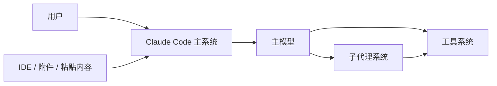
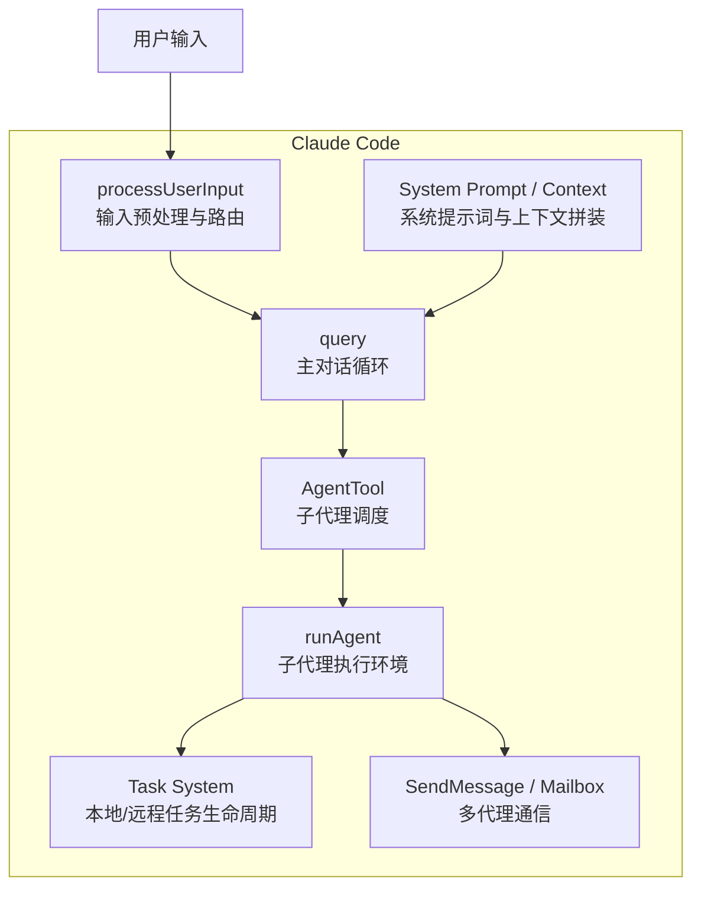
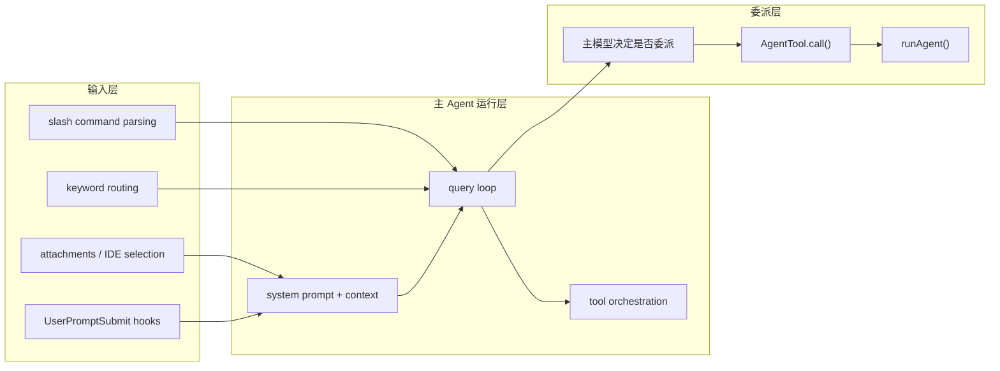
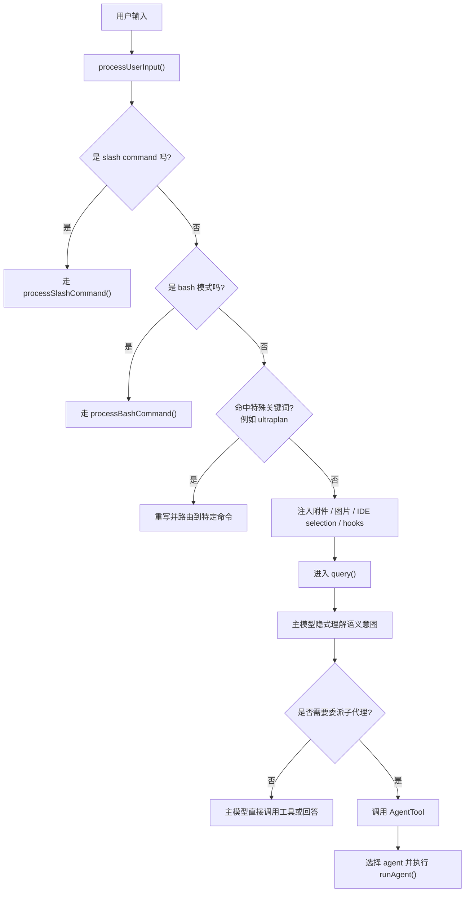
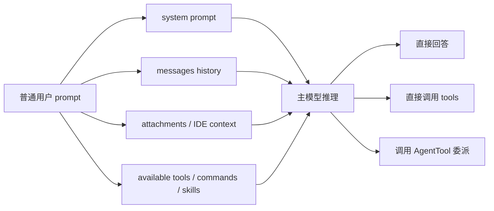

# 意图识别与流程嵌入

## 总结
Claude Code 这套系统里的“意图识别”并不是一个单独的 `intent classifier -> agent router` 模块。它更接近一种**分层路由机制**：

1. 输入预处理阶段做硬规则分流
2. 普通 prompt 进入主对话循环
3. 主模型结合 system prompt、tools、上下文隐式理解用户意图
4. 只有当主模型决定委派时，才进入 `AgentTool`

换句话说：

- **显式意图**：由规则和命令入口处理
- **语义意图**：由主 agent 在推理阶段隐式完成
- **agent 选择**：发生在主模型已经决定调用 `AgentTool` 之后

相关示例：

- [Agent 流程示例](./AGENT_FLOW_EXAMPLES.md)
- [主 System Prompt 结构](./SYSTEM_PROMPT_STRUCTURE.md)

## 它在流程中的位置
如果只问“意图识别发生在 agent 的哪个阶段”，答案是：

- 一部分发生在 **agent 之前**
  - slash command
  - bash mode
  - 特殊关键词触发，例如 `ultraplan`
- 一部分发生在 **主 agent 推理阶段**
  - 是否要搜索
  - 是否要规划
  - 是否要委派子代理
  - 是否自己直接执行

所以，Claude Code 不是“先识别意图，再选择 agent”，而是：

**先做轻量规则路由，再让主 agent 在完整上下文里判断怎么执行。**

## 关键代码位置

### 输入预处理
- [utils/processUserInput/processUserInput.ts](./utils/processUserInput/processUserInput.ts)
- [utils/processUserInput/processTextPrompt.ts](./utils/processUserInput/processTextPrompt.ts)

负责：

- slash command 识别
- bash 模式分流
- `ultraplan` 关键词路由
- 附件 / 图片 / IDE selection / pasted content 注入
- UserPromptSubmit hooks

### 轻量关键词信号
- [utils/userPromptKeywords.ts](./utils/userPromptKeywords.ts)

这里能看到一些轻量信号：

- `matchesNegativeKeyword()`
- `matchesKeepGoingKeyword()`

这类信号更像交互埋点和状态辅助，不是完整意图分类器。

### 主执行循环
- [query.ts](./query.ts)

普通 prompt 最终进入 `query()`，由主模型结合：

- system prompt
- 当前工具集
- 当前消息历史
- 附件和上下文注入

隐式完成语义理解。

### agent 调度
- [tools/AgentTool/AgentTool.tsx](./tools/AgentTool/AgentTool.tsx)

`AgentTool` 本身不是意图识别器，它是调度器。它处理的是：

- 选哪个 agent
- 用什么权限
- 用什么工具
- 同步还是异步
- 本地还是远程

## C4 风格结构图

### C4 - System Context


### C4 - Container


### C4 - Component


## 主流程图

### 流程图 1：意图识别嵌入主流程


### 流程图 2：主模型中的隐式意图判断


### 流程图 3：意图识别与 agent 的先后关系
```text
用户输入
  -> processUserInput()
     -> 显式规则识别
        - slash command
        - bash mode
        - 特殊关键词
     -> 上下文增强
        - attachments
        - hooks
        - IDE selection
  -> query()
     -> 主模型隐式意图理解
     -> 决定执行策略
        - 自己回答
        - 自己调用工具
        - 委派 AgentTool
  -> AgentTool.call()
     -> runAgent()
```

## 对 Claude Code 的结构性判断

### 1. 它没有把“意图识别”单独产品化
从当前代码看，没有发现一个独立的“输入分类器服务”专门做：

- 这是研究型任务
- 这是规划型任务
- 这是验证型任务
- 应该用哪个 agent

这类判断主要还是让主模型自己在推理时完成。

### 2. 它做了很强的“硬路由入口”
Claude Code 真正明确做了强规则分流的是：

- `/command`
- `bash mode`
- `ultraplan` 这类特殊关键词
- hook 阶段的阻断与注入

所以它对“显式用户意图”是规则优先的。

### 3. 它把“语义路由”留给主模型
像下面这些判断，并不是硬编码 intent router 做的：

- 要不要搜索代码
- 要不要规划
- 要不要派子代理
- 要不要验证

这说明它更信任：

- 主模型
- system prompt
- 工具定义
- 当前上下文

来共同完成语义路由。

## 如果你要模仿 Claude，这部分该怎么学

### 1. 先实现“硬路由意图”
你自己的系统里，建议先把这些做成显式入口：

- `/plan`
- `/review`
- `/search`
- `/agent`
- `/task`

这类不应该全交给模型猜。

### 2. 只做少量轻量规则识别
比如：

- `continue`
- `keep going`
- 特殊关键字触发某个专门流程

不要一开始就做一个很复杂的前置 intent classifier。

### 3. 大部分语义意图交给主 agent
让主 agent 自己根据：

- system prompt
- 当前 tools
- 当前上下文
- 历史消息

决定：

- 我自己做
- 我调用工具
- 我委派子代理

### 4. AgentTool 不做理解，只做调度
这是 Claude 非常值得模仿的一点：

- 理解用户意图：主模型
- 按规则选 agent 并执行：AgentTool

把这两层分开，架构会稳很多。

## 最后一句话
Claude Code 的意图识别，本质上是：

**显式规则路由在前，主模型隐式语义判断在后，AgentTool 只负责执行委派，不负责理解用户。**
