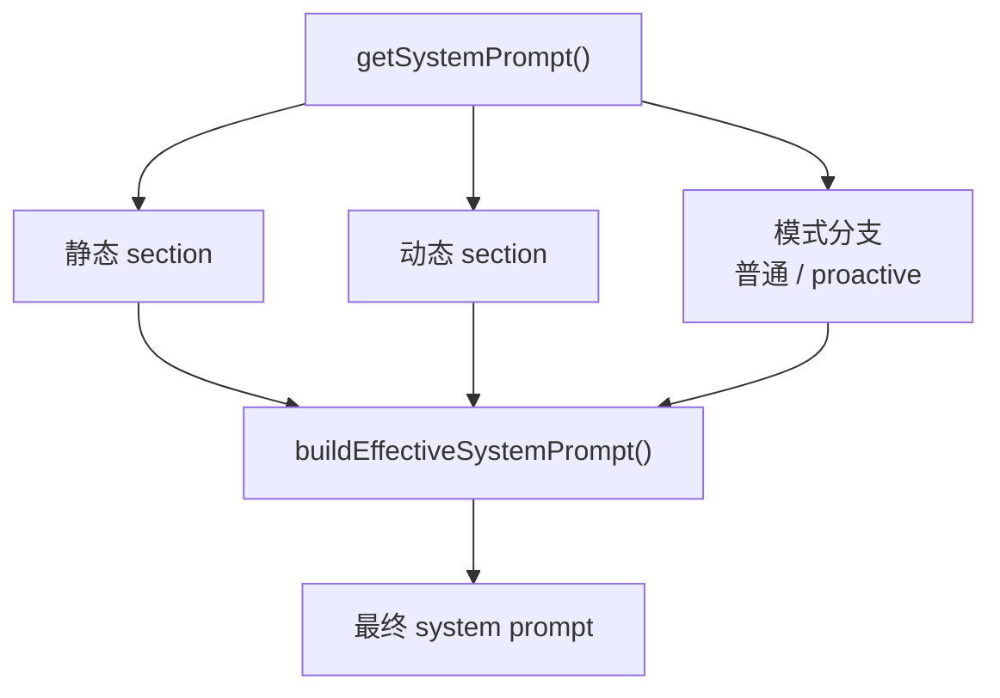
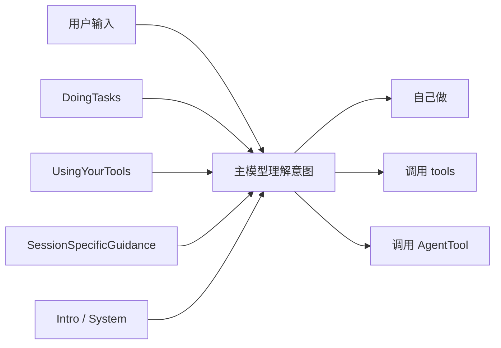
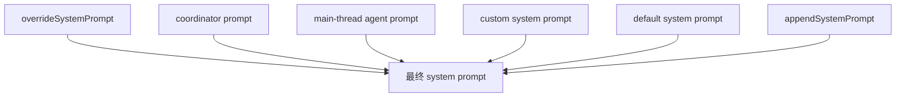

# 主 System Prompt 结构

## 目的
这份文档专门拆解 Claude Code 主线程使用的 system prompt 结构，重点关注：

- 主 prompt 的来源在哪里
- 最终是怎么拼起来的
- 每个 section 分别负责什么
- 哪些 section 会影响 agent 路由
- 哪些设计值得模仿

相关文档：

- [AGENT_SUBSYSTEM.md](./AGENT_SUBSYSTEM.md)
- [INTENT_RECOGNITION.md](./INTENT_RECOGNITION.md)

## 关键入口

### 内容定义层
主要在：

- [constants/prompts.ts](./constants/prompts.ts)

这里定义了各个 section 的内容。

### 最终合并层
主要在：

- [utils/systemPrompt.ts](./utils/systemPrompt.ts)

这里的 `buildEffectiveSystemPrompt(...)` 决定最后哪个 prompt 生效，以及不同 prompt 之间的优先级。

## 一、主 System Prompt 的整体结构
可以把 Claude Code 的主 system prompt 理解为：

```text
主系统提示 = 静态行为规则
          + 工程执行规则
          + 输出规则
          + 动态会话上下文
          + 模式增强（如 proactive）
          + 最终覆盖/追加逻辑
```

它不是一个固定长字符串，而是一个**分段拼装系统**。

## 图 1：主 System Prompt 结构图


## 二、主要 Section 一览

### 1. `getSimpleIntroSection()`
位置：

- [constants/prompts.ts](./constants/prompts.ts)

作用：

- 定义 Claude Code 的基本身份
- 说明它是交互式 agent
- 给出总任务范围

特点：

- 偏身份和总目标
- 比较稳定

是否动态：

- 部分动态，和 output style 有关

是否影响 agent 路由：

- 间接影响
- 因为它定义了模型如何理解“你是一个做软件工程任务的 agent”

是否值得模仿：

- 非常值得
- 建议你自己的系统也有一个稳定的“身份 + 总职责” section

---

### 2. `getSimpleSystemSection()`
作用：

- 说明输出会展示给用户
- 说明权限系统如何工作
- 说明 hook 信息是系统提供的
- 说明上下文会自动压缩

特点：

- 偏系统运行规则

是否动态：

- 基本静态

是否影响 agent 路由：

- 间接影响
- 它不决定“用哪个 agent”，但会影响模型如何对待工具、hook、权限和消息

是否值得模仿：

- 必须模仿
- 这是把你的 agent 从“聊天模型”变成“系统内执行体”的关键

---

### 3. `getSimpleDoingTasksSection()`
作用：

- 规定做软件工程任务时的行为方式
- 约束不要过度设计
- 约束不要乱加抽象
- 强调先读代码再改
- 强调如实汇报验证结果

特点：

- 这是最像“工程行为规范”的 section
- 对代码风格、任务完成标准影响很大

是否动态：

- 有少量按环境分支

是否影响 agent 路由：

- 间接影响非常大
- 因为它会影响主模型判断：
  - 要不要先读代码
  - 要不要先规划
  - 要不要用验证 agent

是否值得模仿：

- 非常值得
- 这是你仿制 Claude 时最该学习的一块之一

---

### 4. `getActionsSection()`
作用：

- 定义高风险操作的审慎原则
- 强调 destructive / irreversible / shared-state action 要谨慎

特点：

- 偏安全和 blast radius 控制

是否动态：

- 基本静态

是否影响 agent 路由：

- 不直接决定 agent 选择
- 但会影响主模型是否先 ask / confirm

是否值得模仿：

- 强烈建议保留
- 对实际工程系统非常重要

---

### 5. `getUsingYourToolsSection()`
作用：

- 规定如何使用工具
- 优先使用专用工具而不是 Bash
- 允许并鼓励并行 tool call
- 引导使用 task/todo 工具

特点：

- 直接塑造工具调用习惯

是否动态：

- 是
- 依赖当前 enabled tools

是否影响 agent 路由：

- 间接影响
- 因为它会影响模型什么时候觉得需要 `AgentTool`、`TodoWrite`、`TaskCreate` 等

是否值得模仿：

- 必须模仿
- 如果你有多种工具，这类 section 非常关键

---

### 6. `getSessionSpecificGuidanceSection()`
作用：

- 注入和当前 session 强相关的指导
- 包括：
  - AskUserQuestion
  - AgentTool
  - Explore / Plan 使用建议
  - skills 使用方式
  - verification agent 使用契约

特点：

- 这是最接近“路由增强器”的 section

是否动态：

- 强动态
- 依赖：
  - 当前有哪些 tools
  - 当前有哪些 skills
  - feature flags
  - verification agent 是否开启

是否影响 agent 路由：

- **是，影响很大**
- 因为它明确告诉主模型：
  - 什么时候适合用 `AgentTool`
  - 什么时候用 `Explore`
  - 什么时候必须走 `verification`

是否值得模仿：

- 非常值得
- 如果你想让主模型稳定地做“隐式语义路由”，这一层非常重要

---

### 7. `getOutputEfficiencySection()`
作用：

- 约束输出简洁、直接
- 约束在什么时候该汇报，什么时候不该啰嗦

特点：

- 偏输出行为控制

是否动态：

- 有环境差异

是否影响 agent 路由：

- 基本不直接影响

是否值得模仿：

- 值得
- 但优先级低于任务行为规范和工具规则

---

### 8. `getSimpleToneAndStyleSection()`
作用：

- 定义语气风格
- 是否用 emoji
- 如何引用代码位置
- 不要在 tool call 前加奇怪冒号

特点：

- 偏表层表达规范

是否动态：

- 较弱

是否影响 agent 路由：

- 基本不影响

是否值得模仿：

- 可以模仿
- 但不是架构级重点

---

### 9. `getProactiveSection()`
作用：

- 只在 proactive / KAIROS 模式下注入
- 把模型切换到 autonomous tick-driven worker 模式

内容要点：

- 你会收到 `<tick>`
- 没事时必须 `Sleep`
- 第一次 wake-up 先问用户要做什么
- 后续 wake-up 要主动寻找有价值工作
- 用户活跃时优先响应用户
- 根据 `terminalFocus` 调整自治程度

是否动态：

- 是
- 依赖 proactive/KAIROS 是否激活

是否影响 agent 路由：

- 会影响整体决策风格
- 在这种模式下，主模型更偏主动委派和自主执行

是否值得模仿：

- 如果你要做常驻 agent，非常值得
- 如果你只做 request/response agent，可以先不实现

## 三、哪些 section 最影响“意图识别 / agent 路由”
如果只从“主模型为什么会决定用哪个 agent”这个角度看，最关键的是这几块：

### 一级关键
- `getSimpleDoingTasksSection()`
- `getUsingYourToolsSection()`
- `getSessionSpecificGuidanceSection()`

### 二级关键
- `getSimpleIntroSection()`
- `getSimpleSystemSection()`
- `getProactiveSection()`

### 次要关键
- `getOutputEfficiencySection()`
- `getSimpleToneAndStyleSection()`
- `getActionsSection()`

## 图 2：哪些 section 最影响路由


## 四、最终合并逻辑
`buildEffectiveSystemPrompt(...)` 决定最后谁覆盖谁。

优先级大致是：

1. `overrideSystemPrompt`
2. coordinator prompt
3. main-thread agent prompt
4. custom system prompt
5. default system prompt

另外：

- `appendSystemPrompt` 总是追加在最后
- proactive 模式下，main-thread agent prompt 会附加到默认 prompt 后，而不是完全替换

## 图 3：最终 prompt 优先级


## 五、如果你要模仿 Claude，这部分该怎么学

### 1. 不要写一个超长固定 prompt
更好的做法是分段：

- 身份 section
- 系统规则 section
- 工程行为 section
- 工具使用 section
- 动态会话 section
- 模式增强 section

### 2. 把“路由增强”单独做成 section
Claude 很聪明的一点是，它没有单独写一个 router classifier，而是通过：

- `UsingYourTools`
- `SessionSpecificGuidance`

去影响主模型的选择。

这特别值得模仿。

### 3. 区分“稳定规则”和“动态上下文”
你自己的系统里，建议至少分成：

#### 稳定规则
- 身份
- 输出规则
- 工程风格
- 工具使用规范

#### 动态上下文
- 当前可用 tools
- 当前可用 agents
- 当前用户设置
- 当前会话模式

### 4. 真正最值得模仿的三块
如果你时间有限，最值得学的是：

1. `getSimpleDoingTasksSection()`
2. `getUsingYourToolsSection()`
3. `getSessionSpecificGuidanceSection()`

这三块最直接决定系统是不是像一个“工程 agent”，以及会不会稳定地做合理委派。

## 最后一句话
Claude Code 的主 system prompt 不是一段固定人设文案，而是：

**一个由静态工程规则、动态会话信息、工具使用约束和路由增强提示共同组成的 prompt 组合系统。**
